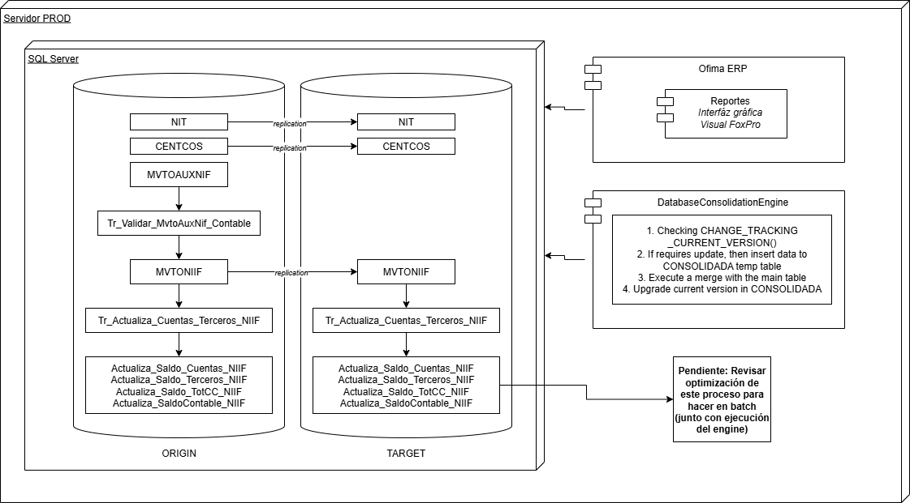

# Database Consolidation Engine

**DatabaseConsolidationEngine** is a production-grade, near-real-time database replication system built in C# .NET 9. It runs as a Windows Service that continuously polls multiple SQL Server source databases using the native **Change Tracking** feature and replicates incremental changes into a single centralized target database.

The system was designed for high-throughput ERP environments where tens of source branches must be consolidated into one reporting or operational database — handling thousands of transactions per minute — **without imposing load on the source systems** or requiring any application-side changes.

Below is an example production diagram. In this deployment, 25 source databases are replicated in real-time into a single consolidated database for nationwide billing.



---

## Table of Contents

- [High-Level Architecture](#high-level-architecture)
- [Component Breakdown](#component-breakdown)
- [Data Flow](#data-flow)
- [SQL Infrastructure](#sql-infrastructure)
- [Scalability](#scalability)
- [Resiliency](#resiliency)
- [Observability](#observability)
- [Configuration](#configuration)
- [Deployment](#deployment)

---

## High-Level Architecture

```
┌─────────────────────────────────────────────────────────────────────┐
│                        SQL Server Instance                          │
│                                                                     │
│  Source DBs (N)             ConsolidationEngine          Target DB  │
│  ┌──────────┐               ┌──────────────────┐        ┌────────┐ │
│  │ DB_1     │──CT Changes──►│  Orchestrator    │──MERGE─►│        │ │
│  │ DB_2     │──CT Changes──►│  (parallel jobs) │──MERGE─►│ CONSOL │ │
│  │ ...      │──CT Changes──►│                  │──MERGE─►│ IDADA  │ │
│  │ DB_N     │──CT Changes──►│  FaultRetry      │        │        │ │
│  └──────────┘               └──────────────────┘        └────────┘ │
│                                      │                              │
│                              ConsolidationDashboard (WinForms)      │
│                              Real-time status · Errors · Logs       │
└─────────────────────────────────────────────────────────────────────┘
```

The engine operates as a **pull-based CDC (Change Data Capture)** pipeline. Every heartbeat cycle it:

1. Detects new Change Tracking versions on every source database.
2. Fetches changed rows since the last recorded watermark.
3. Applies changes to the target database via a staging-table MERGE + bulk delete.
4. Advances the watermark on success.
5. Optionally retries any previously failed records.

---

## Component Breakdown

### `ConsolidationEngine` — Windows Service (.NET 9)

| Component | Responsibility |
|---|---|
| `Worker` | `BackgroundService` host. Drives the heartbeat loop, triggers schema validation at startup, and guards the cycle with a top-level catch to prevent service crashes. |
| `ChangeTrackingOrchestrator` | Spawns one `Task` per _(source DB, table)_ pair. Uses a `ConcurrentDictionary` as a job registry to prevent duplicate concurrent jobs for the same key. |
| `ChangeTrackingETL` | Per-pair ETL pipeline. Reads CT versions, fetches delta rows, dispatches upserts and deletes, and advances the watermark. |
| `FaultRetryProcessor` | Async retry loop. Queries `ConsolidationEngineErrors` for records flagged `Retry = 1`, replays their stored SQL payload, and marks them resolved. |
| `SqlSchemaValidator` | Startup guard. Validates connectivity to all source and target databases. Automatically adds any columns present in source but missing in target (schema drift auto-repair). |
| `SqlConsolidationHelper` | Core SQL operations: watermark management, change fetching, `SqlBulkCopy` into a temp `#stage` table, MERGE-based upsert with per-row fallback, and batch delete. |
| `SqlConnectionBuilder` | Thread-safe singleton connection factory. Supports both SQL Server Authentication and Windows Authentication. |
| `DualLogger` / `ERPLogger` | Dual-sink logger. Writes to the .NET `ILogger` pipeline (console + Windows Event Log) **and** persists structured records to `ConsolidationEngineLogs` and `ConsolidationEngineErrors` SQL tables. |

### `ConsolidationDashboard` — Windows Forms Monitor

A lightweight WinForms desktop application that connects to the consolidated database and provides:

- **Sync status grid**: source DB, local CT version, consolidated watermark version, and sync state (`Sincronizada` / `Pendiente` / `Desactualizada`).
- **Error detail grid**: pending replication errors with retry support.
- **Log viewer**: recent engine activity log.
- **Pie chart**: visual ratio of synchronized vs. out-of-sync databases.
- **Auto-refresh** every 5 seconds; manual refresh button.
- **Retry-all button**: invokes `dbo.ConsolidationEngineRetryAll` to schedule all pending errors for reprocessing.

---

## Data Flow

```
[Source DB] CHANGE_TRACKING_CURRENT_VERSION()
        │
        ▼
[ETL] Compare toVersion vs. watermark fromVersion
        │  no changes → advance watermark, exit
        │  changes detected ▼
[ETL] CHANGETABLE(CHANGES …) + LEFT JOIN source table
        │
        ▼
[Repository] SqlBulkCopy → #stage (temp table)
        │
        ├─ INSERT/UPDATE rows ──► MERGE #stage INTO target (upsert)
        │                              ↓ per-row fallback on batch timeout
        │
        └─ DELETE rows ──────────► DELETE target WHERE keyCol IN (…)
                │
                ▼
[ETL] SetWatermark(toVersion)
        │
        ▼
[FaultRetry] Poll ConsolidationEngineErrors WHERE Retry=1
             │ replay SQL payload
             └► mark Retry=2 on success
```

Each row written to the target carries a `SourceKey` column (`{OriginDB}_{KeyValue}`) that uniquely identifies the record's origin, enabling traceability and conflict-free multi-source merging.

---

## SQL Infrastructure

The following control tables are created in the target database by `ConsolidationEngineInitialConfig.sql`:

| Table | Purpose |
|---|---|
| `ConsolidationEngineWatermark` | Stores the last processed CT version per _(server, source DB, table)_. Acts as the persistent checkpoint for resumability. |
| `ConsolidationEngineErrors` | Error journal. Stores the original SQL payload, source key, operation type, and retry state (`0` = pending, `1` = scheduled for retry, `2` = resolved). |
| `ConsolidationEngineLogs` | Structured activity log persisted to SQL for dashboard consumption and post-mortem analysis. |

Key database objects:

| Object | Purpose |
|---|---|
| `dbo.ConsolidationEngineStatus` (SP) | Compares local CT version with the watermark version to compute real-time sync lag per source database. |
| `dbo.ConsolidationEngineRetryAll` (SP) | Flags all unresolved errors (`Retry = 0`) as ready for retry (`Retry = 1`). |
| `dbo.ConsolidationEngineErrorsView` | Top-25 active (non-resolved) errors. |
| `dbo.ConsolidationEngineLogsView` | Top-25 most recent log entries. |

---

## Scalability

**Horizontal fan-out via parallel tasks**  
The `ChangeTrackingOrchestrator` fires one `Task.Run` per _(source DB × table)_ combination per heartbeat. With N source databases and M tables, up to N×M independent jobs run concurrently per cycle, fully utilizing available threads without blocking each other.

**Batch-oriented data transfer**  
All data movement uses `SqlBulkCopy` into an intermediate `#stage` temp table before applying a single MERGE statement. The batch size is governed by `BatchSize` (default: 5,000 rows), keeping individual transactions predictably sized and reducing memory spikes.

**Configurable heartbeat**  
`HeartbeatSeconds` controls the polling interval. In low-latency environments this can be set to 5–15 seconds; in lower-priority scenarios it can be extended to reduce SQL load.

**Zero-impact on source databases**  
SQL Server Change Tracking is a lightweight, log-based mechanism maintained by the SQL engine itself. The engine only reads the CT delta — it never scans full tables, never installs triggers, and never modifies source schemas.

**Linear source database growth**  
Adding a new source database requires one configuration entry (`Databases` array in `appsettings.json`) and executing the CT enablement script. No code changes are needed. The orchestrator picks up new pairs automatically on next startup.

---

## Resiliency

**Watermark-based checkpointing**  
Every ETL job persists its progress to `ConsolidationEngineWatermark` only after successfully applying changes. If the service crashes mid-cycle, the next run re-processes from the last committed version — guaranteeing **at-least-once delivery** with idempotent MERGE semantics.

**Change Tracking minimum version guard**  
Before processing, the ETL compares the stored watermark against SQL Server's `CHANGE_TRACKING_MIN_VALID_VERSION`. If the watermark has expired (CT history was purged), the engine fast-forwards the watermark to the current version and logs a warning rather than crash-looping.

**Job deduplication**  
The `ConcurrentDictionary<string, Task>` in the orchestrator ensures that if a previous ETL job for a given _(DB, table)_ key is still running when the next heartbeat fires, the new invocation is skipped with a warning rather than stacking up concurrent conflicting writes.

**Fault Retry Processor**  
Failed row-level operations (batch or individual) are persisted to `ConsolidationEngineErrors` with their original SQL payload. The `FaultRetryProcessor` runs asynchronously every heartbeat cycle and replays those payloads, with outcome tracking and retry counter. This decouples transient failures from the main replication path.

**Upsert with per-row fallback**  
The bulk MERGE path is wrapped with a configurable timeout (`UpsertBatchWithFallbackTimeoutSeconds`). If the batch operation times out, the engine falls back to individual row-level operations to rescue partial batches, and any row that fails individually is captured in `ConsolidationEngineErrors` for later retry.

**Startup schema validation and auto-repair**  
At service startup, `SqlSchemaValidator` verifies connectivity to every configured database and compares column definitions between each source and target table. Any column present in the source but absent in the target is added automatically via `ALTER TABLE`. This prevents schema drift from causing replication failures after an ERP upgrade.

**Isolated error handling per job**  
Each ETL task is individually wrapped in try/catch. A failure in one _(DB, table)_ job does not affect other running jobs. The heartbeat loop itself has an outer catch to ensure the service continues running even if an unexpected error escapes a job.

**Windows Service lifetime management**  
The service uses `UseWindowsService()` and integrates with the Windows Service Control Manager. The host honors graceful `CancellationToken` shutdown and can be managed through standard `sc.exe` or Windows Services.

---

## Observability

**Structured dual-sink logging**  
`DualLogger` routes every log event through both the .NET `ILogger` abstraction (→ Console + Windows Event Log) and `ERPLogger` (→ SQL tables). This means operational logs are available both in real-time (Event Viewer, console) and historically queryable in SQL.

**SQL-persisted error journal**  
`ConsolidationEngineErrors` stores the full error context: source key, database, table, operation type, error message, stack details, original SQL payload, and retry state. This enables post-mortem analysis without needing to correlate log files.

**ConsolidationDashboard real-time UI**  
The WinForms dashboard provides at-a-glance visibility via a 5-second auto-refresh cycle:
- Per-source-DB sync lag (local CT version vs. consolidated watermark).
- Sync state classification: `Sincronizada` (up-to-date), `Pendiente` (lag exists), `Desactualizada` (watermark ahead of source).
- Error count and timestamp of last error per source database.
- Pie chart showing the proportion of databases in sync.

**Heartbeat logging**  
Every cycle emits a timestamped heartbeat log entry, providing a simple liveness signal for monitoring tools.

---

## Configuration

All engine behavior is driven by `appsettings.json`. No recompilation is required to add databases or tables.

```json
{
  "HeartbeatSeconds": 15,
  "ConsolidationEngine": {
    "Server": "YOUR_SQL_SERVER",
    "User": "",
    "Password": "",
    "FaultRetryProcessorEnabled": true,
    "BatchSize": 5000,
    "UpsertBatchWithFallbackTimeoutSeconds": 800,
    "Databases": [
      { "Origin": "BRANCH_A", "Target": "CONSOLIDATED" },
      { "Origin": "BRANCH_B", "Target": "CONSOLIDATED" }
    ],
    "Tables": [
      { "Name": "dbo.MVTONIIF", "KeyColumn": "IDMVTO", "SkipPrimaryKey": true },
      { "Name": "dbo.CENTCOS", "KeyColumn": "CODCC" }
    ]
  }
}
```

| Setting | Description |
|---|---|
| `HeartbeatSeconds` | Polling interval in seconds. |
| `BatchSize` | Rows per `SqlBulkCopy` batch and MERGE statement. |
| `UpsertBatchWithFallbackTimeoutSeconds` | Timeout before switching to row-by-row fallback. |
| `FaultRetryProcessorEnabled` | Toggle the retry processor without service restart. |
| `SkipPrimaryKey` | Omit the primary key from INSERT/UPDATE when the target uses a surrogate PK. |

**Authentication**: leave `User`/`Password` empty for Windows Integrated Authentication; populate both for SQL Server Authentication.

---

## Deployment

### 1. Initialize SQL infrastructure

Run `SQL/ConsolidationEngineInitialConfig.sql` against the target (consolidated) database. This creates the control tables, views, stored procedures, enables Change Tracking on source databases, and registers initial watermarks.

### 2. Publish the service

```bash
dotnet publish -c Release -r win-x64 --self-contained true -o ./publish
```

Or use the provided `dce-publisher.bat`.

### 3. Install as a Windows Service

```bash
sc create "ConsolidationEngine" binPath= "C:\path\to\ConsolidationEngine.exe"
sc start "ConsolidationEngine"
```

Or use the provided `dce-installer.bat`.

### 4. Deploy the Dashboard

Build the `ConsolidationDashboard` project and update `App.config` with the consolidated database connection string. Run `ConsolidationDashboard.exe` on any Windows machine with network access to the SQL Server.