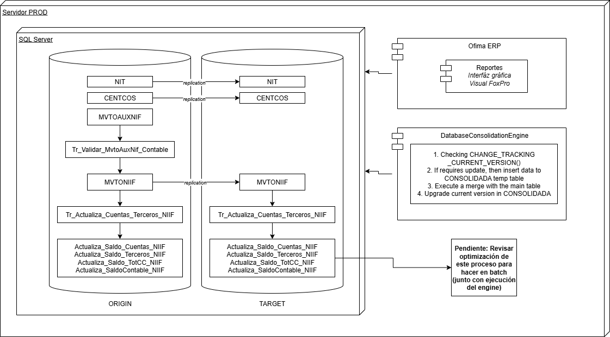

# Database Consolidation Engine

This repository contains DatabaseConsolidationEngine, a database consolidation engine built in C# .NET. Its core component, ConsolidationEngine, functions as a service that continuously monitors multiple databases using SQL Server's Change Tracking feature.

The engine is responsible for detecting changes across a configurable number of databases and replicating the updated data into a single, centralized database. It ensures data consistency and integrity by following predefined replication rules and handling versioning appropriately.

This project is ideal for scenarios that require consolidating information from multiple SQL Server instances without impacting the performance of the source databases. It provides reliable, consistent replication, ensuring that the centralized database always reflects the correct state of all source databases. The use of Change Tracking combined with merge strategies and staging tables enhances efficiency and performance, making it well-suited for high-transaction environments where data integrity is critical.

Below is an example of a solution diagram in a production environment, where the system is integrated into a Colombian ERP for a medium-sized company. In this setup, 25 databases are replicated into a single database, handling thousands of transactions per minute (real-time billing nationwide).

## Publish the service

dotnet publish -c Release -r win-x64 --self-contained true -o ./publish